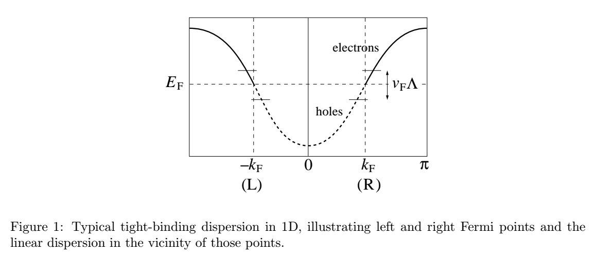

# §3 １次元における電子相互作用

## 3.1 連続場と密度

微視的なハミルトニアンは次のような形を取る.

$$
\begin{aligned}
    H_{\rm F}
    = \sum_{\bm{k}}\varepsilon(k)c^{\dagger}(k)c(k) \tag{11}
\end{aligned}
$$

低次元における理論はフェルミ点近傍(Fig. 1)の生成消滅演算子を用いて次のように表される.

$$
\begin{aligned}
    \alpha(k) =& c(k_{\rm F}+k)\\
    \alpha(-k) =& c(-k_{\rm F}-k)\\
    \beta(k) =& c^{\dagger}(k_{\rm F}-k)\\
    \beta(-k) =& c^{\dagger}(-k_{\rm F}+k) \tag{12}
\end{aligned}
$$

ここで, $k>0$としている.
すると相互作用なしの場合のハミルトニアン(11)は次のような形を取る.

$$
\begin{aligned}
    H_{\rm F}
    =& \sum_{k}\varepsilon(k)c^{\dagger}(k)c(k)\\
    =& \sum_{k > k_{\rm F}} \varepsilon(k)c^{\dagger}(k)c(k)
    + \sum_{k < k_{\rm F}} \varepsilon(k)c^{\dagger}(k)c(k)\\
    =& \sum_{0 < k < \Lambda} \varepsilon(k+k_{\rm F})c^{\dagger}(k+k_{\rm F})c(k+k_{\rm F})\\
    &+ \sum_{-\Lambda < k < 0} \varepsilon(k+k_{\rm F})c^{\dagger}(k+k_{\rm F})c(k+k_{\rm F}) 
    &\because k-k_{\rm F}\to k\\
    =& \sum_{0 < k < \Lambda} v|k|\left(c^{\dagger}(k_{\rm F}+k)c(k_{\rm F}+k)+c^{\dagger}(k_{\rm F}-k)c(k_{\rm F}-k)\right)
    &\because \varepsilon(k)\approx v|k|\\
    =& \sum_{0 < k < \Lambda} v|k|\left(\alpha^{\dagger}(k)\alpha(k)+\beta^{\dagger}(k)\beta(k)\right) \\
    \approx& \int\frac{dk}{2\pi}v|k|\left\{\alpha^{\dagger}(k)\alpha(k)+\beta^{\dagger}(k)\beta(k)\right\} &\because\text{to continuum} \tag{13}
\end{aligned}
$$

以上の式変形の最中で次のような値を定義して用いている.

- $v$ : フェルミ速度. これは微視的な議論から得られるパラメータである.
- $\Lambda$ : カットオフの波数. 線形近似が成立する範囲内に定義する.

また(12)については, 右のフェルミ点近傍($k>0$)と左のフェルミ点近傍($k<0$)でそれぞれ定義された,

- $\alpha$ : 電子
- $\beta$ : ホール

の生成演算子である.

位置空間を考えた場合の$n$サイトにおける消滅演算子は, 遅い場$\psi,\bar{\psi}$を導入して次のように表すことが可能.

$$
\begin{aligned}
    \frac{c_{x}}{\sqrt{a}}
    = \psi(x)e^{ik_{\rm F}x}+\bar{\psi}(x)e^{-ik_{\rm F}x} \tag{14}
\end{aligned}
$$

$\sqrt{a}$は(工学的な)次元を反映した, 場の演算子とデルタ関数を受け渡す係数である.

## 左-右 分割 (Left-right separation)

aa